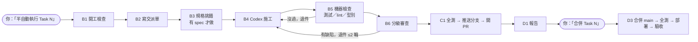

# semi-auto-collab：Claude 工頭 × Codex 施工

> 讓 [Claude Code](https://claude.com/claude-code) 當工頭、[OpenAI Codex CLI](https://github.com/openai/codex) 當施工隊的半自動開發流程。你核可計畫、喊開工、最後批准合併，中間的交派、檢查、退件與開 PR 交給 AI 完成。
>
> *A Claude Code / Codex CLI skill: Claude plans, dispatches and reviews; Codex builds. Humans approve the plan and the merge. Docs are in Traditional Chinese.*

## 為什麼做這個

同時用 Claude 和 Codex 寫程式的人，常常要自己當傳話筒：把 Claude 寫好的計畫複製給 Codex，再把 Codex 的成果貼回去給 Claude 看，來回好幾輪。這個技能把傳話流程固定下來：

- **分工清楚**：Claude 負責規劃與審查，Codex 只負責改檔案。Codex 不能提交、推送或合併，沙盒會把 `.git` 鎖成唯讀。
- **人只在關鍵點出現**：核可計畫、啟動 Task、回答阻塞問題、批准合併。其他步驟照檢查表自動進行。
- **有煞車**：退件最多 2 輪、單次交派 40 分鐘逾時、token 用量超過門檻自動停下、網路預設關閉。
- **留下紀錄**：每個 Task 的交派單、審查結果與測試證據都寫在專案的 `HANDOFF.md`，事後查得到。

## 運作流程



| 角色 | 負責 |
|---|---|
| 你 | 核可計畫、啟動 Task、回答阻塞問題、裁決爭議、批准合併、親自處理登入與密鑰 |
| Claude（工頭） | 開工檢查、交派、機器檢查、審查、提交、推送、開 PR、經批准後合併與部署、報告 |
| Codex（施工） | 規格挑錯（唯讀）、在指定分支修改檔案、填寫施工狀態與測試證據 |

**分級審查**：碰到登入、權限、付費、個資、對外輸入或資料結構的 Task 列為「敏感」，會做完整審查與資安檢查。其他 Task 對照驗收標準與測試結果即可。

## 需要什麼

- [Claude Code](https://claude.com/claude-code)
- [Codex CLI](https://github.com/openai/codex)，用 `npm install -g @openai/codex` 安裝並登入。腳本會從 npm 全域目錄找 Codex。
- Node.js 18 以上、`git`
- GitHub CLI（`gh`），用來開 PR。沒有遠端時流程會停在分支提交。
- Windows PowerShell，用來執行觀看視窗。可以不用；不用的話，其餘流程不受影響。

## 安裝

把同一份資料夾放到 Claude 和 Codex 兩邊的技能目錄：

```bash
git clone https://github.com/nccu1133060/semi-auto-collab ~/.claude/skills/semi-auto-collab
cp -r ~/.claude/skills/semi-auto-collab ~/.codex/skills/semi-auto-collab
```

Claude 讀 `FOREMAN.md` 當工頭；Codex 被交派時讀 `BUILDER.md` 施工。

## 快速開始

**1. 準備專案。** 專案必須是 git 倉庫，根目錄有一份 `HANDOFF.md`，裡面有你已核可的 Task。Task 區塊至少寫負責人、檔案範圍和驗收標準：

```markdown
## Task 3：登入頁加入「記住我」

- 負責人：Codex（實作）｜審查：Claude
- 檔案範圍：
  - src/auth/
- 驗收標準：
  1. 勾選「記住我」後關閉瀏覽器再打開，仍保持登入
```

其他欄位會由 Claude 依 [templates/HANDOFF-task.md](templates/HANDOFF-task.md) 補齊。

**2. 啟動。** 技能只能手動觸發，不會自己跑起來。在 Claude Code 輸入：

```
/semi-auto-collab 半自動執行 Task 3
```

**3. 等報告。** Claude 會交派、檢查、必要時退件，最後推送分支並開 PR，再交給你一份報告。

**4. 批准合併。** 看完報告與 PR 後輸入「合併 Task 3」。沒有這句話，Claude 不會動 `main`。

## 即時觀看 Codex 在做什麼

交派期間會自動開一個 PowerShell 視窗，顯示 Codex 正在執行的指令、思考摘要和修改的檔案。這個視窗只讀紀錄檔，不消耗 token。也可以手動開：

```powershell
powershell -File "$HOME\.claude\skills\semi-auto-collab\scripts\watch-codex.ps1"          # 所有專案中最近一次交派
powershell -File "$HOME\.claude\skills\semi-auto-collab\scripts\watch-codex.ps1" my-app   # 只看 my-app
```

紀錄存在 `~/.claude/semi-auto-logs/<專案名>/`，`usage.jsonl` 記錄每次交派的 token 用量。

## 額度門檻

Codex 使用 ChatGPT 訂閱額度。為了避免一個 Task 吃掉太多額度，流程內建兩道門檻：

| 門檻 | 基準 | 停下回報 |
|---|---|---|
| 單次交派 | 400 萬 token | 超過 800 萬 |
| 整個 Task 累計 | 600 萬 token | 超過 1,200 萬 |

數字以輸入 token（含快取）計算，可以在 `SKILL.md` 依自己的訂閱方案調整。

## 搭配你自己的品質規範

流程會在開工（B1）與收尾（C1）讀取你在 `CLAUDE.md`／`AGENTS.md` 指定的規範，例如測試規範、前端設計規範、資安 QA 規範或技能。本倉庫不附這些規範。沒有的話，檢查表對應項目寫「不適用：原因」即可，資安檢查與截圖自檢會改用流程內建的通用版本。

## 檔案

| 檔案 | 用途 |
|---|---|
| `SKILL.md` | 技能入口：觸發條件、角色、硬性規則、停下條件、額度門檻 |
| `FOREMAN.md` | Claude（工頭）的逐步檢查表 |
| `BUILDER.md` | Codex（施工）的施工規則 |
| `scripts/dispatch.mjs` | 包裝 `codex exec`：固定沙盒、關閉網路、40 分鐘逾時、記錄 token |
| `scripts/watch-codex.ps1` | 即時觀看視窗（Windows PowerShell） |
| `templates/` | `HANDOFF.md` Task 區塊、交派指令、報告範本 |
| `agents/openai.yaml` | Codex 端的顯示名稱，以及「不自動觸發」設定 |

## 限制

- 一次只跑一個 Task。下一個 Task 要等上一個合併後才開始，避免分支疊在一起。
- 觀看視窗目前只有 Windows PowerShell 版本。macOS／Linux 可以直接用 `tail -f` 看 `~/.claude/semi-auto-logs/` 裡的 `.events.jsonl`。
- 只在 Windows 實際使用過。`dispatch.mjs` 有處理 macOS／Linux 的逾時終止，但還沒在這兩個系統完整驗證。
- 流程文件是繁體中文。

## 授權

[MIT](LICENSE)：可以自由使用、修改與再發布，只要保留版權聲明。
